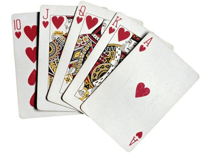

# An intro to Object-Oriented Programming in Python
## Getting Started
Object-oriented programming is commonly used to model real-world things, like cars, and their interactions and behaviors. The objects bundle all relevant information and guarantee that their procedure (methods in case of Python) function as expected.
But before getting into the nitty gritty of OOP, let's first walk through some of the concepts you've just learned.  

We'll practice these concepts by creating a deck of 52 playing cards. Each card will be represented by an object and the deck itself too!

For a quick reminder of the Python basics watch the following Doug-talk.


   
